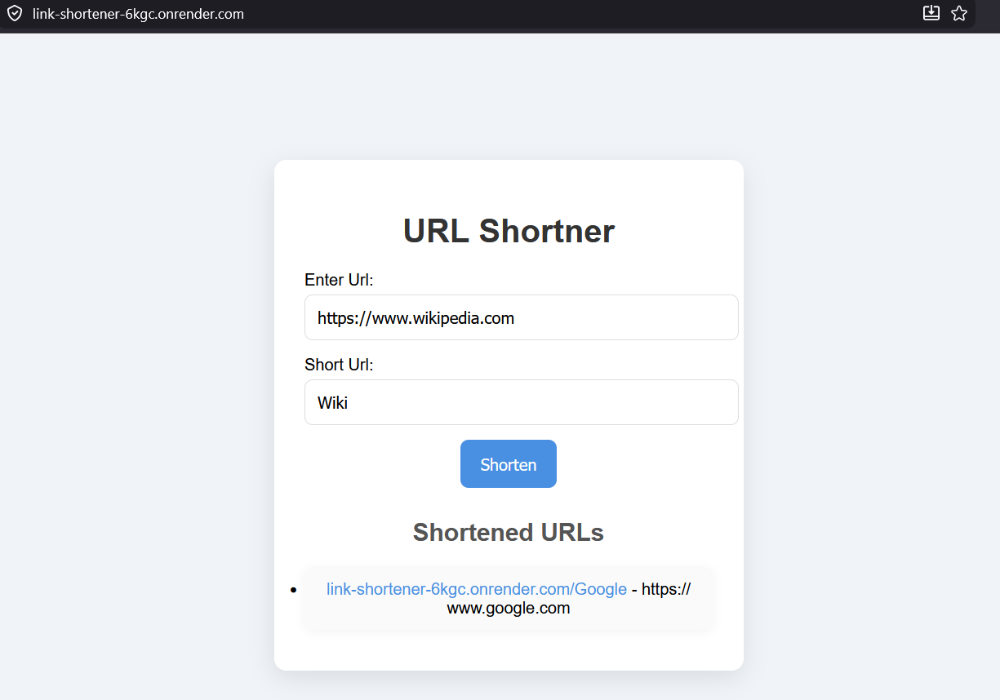

# URL Shortener

A simple URL shortener web application built with **Node.js**, **Express.js**, **MongoDB Atlas**, and **EJS**.

## 🚀 Live Demo

**Application:**
https://link-shortener-6kgc.onrender.com

> **Note:** This project is hosted on Render's free tier. If the application has been inactive for a while, the first request may take 30–60 seconds while the server wakes up.

> ## 📸 Screenshot



## ✨ Features

* Create custom short URLs
* Automatic redirection to original URLs
* MongoDB Atlas integration
* Server-side rendering with EJS
* Environment variable validation using Zod
* Deployable on Render

## 🛠️ Tech Stack

* Node.js
* Express.js
* MongoDB Atlas
* Express.js
* EJS
* Zod
* Dotenv

## 📦 Installation

```bash
After cloning or downloading the repo use 
npm install
```

Create a `.env` file:

```env
PORT=3000
MONGODB_URL=your_connection_string
MONGODB_DATABASE_NAME=your_database_name
```

Run the application:

```bash
node app.js
```

## 🔮 Future Improvements

* QR code generation
* Link expiration
* User authentication
* Copy-to-clipboard functionality
